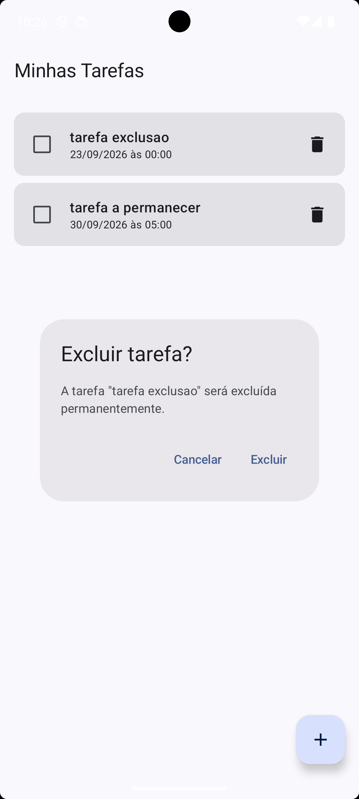
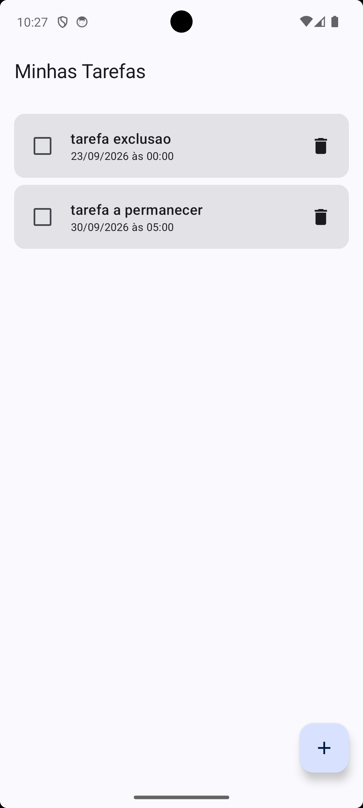
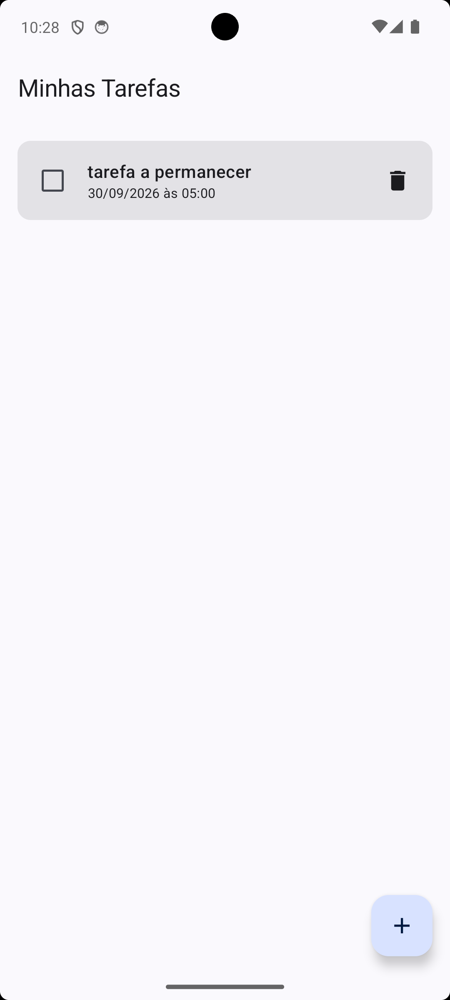

# Evidências da confirmação de exclusão de tarefas

## 1. Lista antes da exclusão

A lista exibe a tarefa que será selecionada para exclusão.

## 2. Diálogo de confirmação aberto

Ao tocar no ícone de lixeira, o diálogo informa o título da tarefa selecionada e disponibiliza as ações Cancelar e Excluir.

## 3. Resultado ao cancelar

Após tocar em Cancelar, o diálogo é fechado e a tarefa permanece na lista.

## 4. Nova abertura do diálogo

O diálogo é aberto novamente para a mesma tarefa.

## 5. Resultado após confirmar a exclusão

Após tocar em Excluir, somente a tarefa selecionada é removida da lista.

